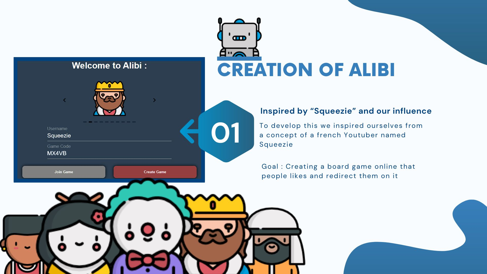
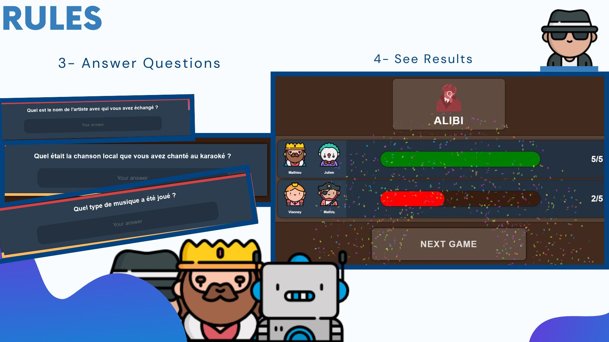
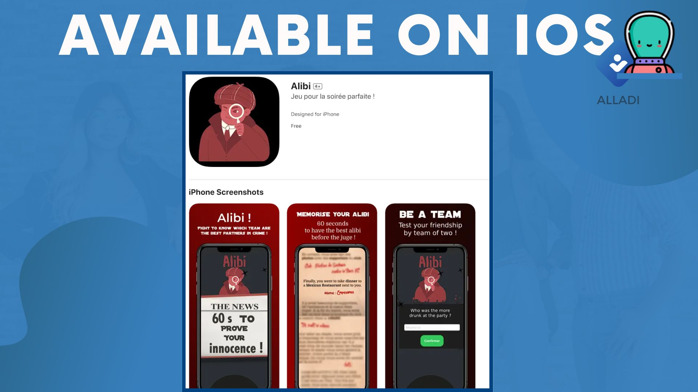

# 🔎 Alibi 🔍

Hello everyone, Julien and Mathieu here! We’re excited to present **Alibi**, a thrilling cooperative adventure game that's fun and engaging, playable with up to 43 players!

 ## Game Pitch 🔔
Suddenly, you and your friend find yourselves accused of murder! With just 60 seconds to establish and memorize your alibi, you'll need to think quickly and act fast before facing the judge!
<br>
## Context 

<br>
## Game Features
- ### Memorize to Win
  You have just 60 seconds to craft and memorize your alibi. Team up with your partner to create a convincing story and commit it to memory before facing the interrogation!
- ### Crucial Complicity
  Exchange ideas, communicate effectively, and synchronize your responses to ensure your alibi aligns perfectly. The key to victory lies in the seamless collaboration and trust between you and your partner!

- ### Various Scenarios
  Immerse yourself in a range of captivating scenarios. From a relaxing day at the beach to an urban adventure or a mysterious evening, each alibi presents a unique and thrilling experience.


## Rules


## Authors

- [@Datharr](https://github.com/Datharr)
- [@7ntys](https://github.com/7ntys)

## Color Reference

| Color             | Hex                                                                |
| ----------------- | ------------------------------------------------------------------ |
| Background Color |  #2c3e50 |
| Primary Color |  #953E40 |


## Deployment

To deploy this project run

in the frontend :
```bash
npm run serve
```
in the backend :
```bash
node express.js
```

## Available also on iOS !


## Tech Stack

**Client:** Vuejs

**Server:** Node, Express


Contributing
Contributions are welcome! If you'd like to contribute to the development of the game, please fork the repository and submit a pull request with your changes.

License
This project is licensed under the MIT License - see the LICENSE file for details.

Contact
For any questions or inquiries, please reach out to mathieu.roche@efrei.net .

You can also connect with me on LinkedIn 

<h3>Where to find me</h3>
<p><a href="https://github.com/Datharr" target="_blank"></a> <a href="https://twitter.com/Guibz16" target="_blank"></a> <a href="https://www.linkedin.com/in/mathieu-roche-efrei/" target="_blank"></a> <a href="https://medium.com/@th.guibert" target="_blank">
</p>

